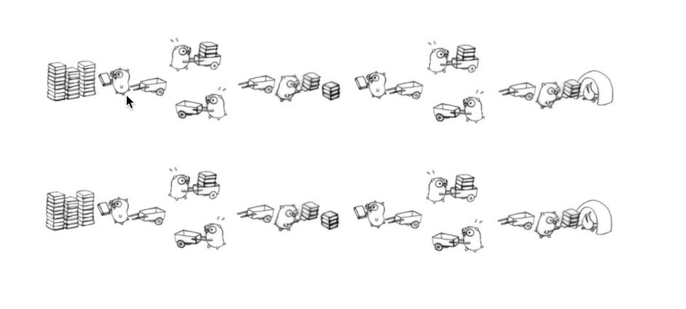

# traffic_statistics_sys

#Golang协程
* 进程：太重
* 线程： 上下文切换开销太大
* 协程：轻量级协程，简洁的并发模式

# go的协程roroutine

* go发起一个协程
* channel协程间通信，通道
* buffered channels 局部缓冲队列的通道

# golang 协程特性实践

* range 缓冲队列的逐个获取方法
    * 只有当chan关闭了，range才会停止循环。在合理的时机关闭chan
* select 多队列的随机选择器
* select 等待机制

# 流量统计系统 Web展示

* Ant Design Pro 开箱即用
    搭建数据可视化web站点
* 数据实时获取
    实时线上数据呈现# learn-golang-item
